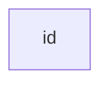

I this tutorial, I am going to show how diagram can be drawn using code. The program I am going to use is called `Mermaid`

## Marmaid Basic 
Let's learn about some of the basic syntax. For practicing, once can use [Mermaid Live Editor](https://mermaid-js.github.io/mermaid-live-editor)

### A Node (default)

graph TD;
    A-->B;
    A-->C;
    B-->D;
    C-->D;

