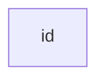

I this tutorial, I am going to show how diagram can be drawn using code. The program I am going to use is called `Mermaid`

## Marmaid Basic 
Let's learn about some of the basic syntax. For practicing, once can use [Mermaid Live Editor](https://mermaid-js.github.io/mermaid-live-editor)

### A Node (default)


<script src="https://unpkg.com/mermaid@8.0.0/dist/mermaid.min.js"></script>
<div class="mermaid">
graph TD;
    A-->B;
    A-->C;
    B-->D;
    C-->D;
</div>


<div class="mermaid">
graph LR;
     id
</div>

It is possible to create box with text as well. 

````
  ```mermaid
    flowchart LR
     id[Test inside the box]
  ```
````

<script src="https://unpkg.com/mermaid@8.0.0/dist/mermaid.min.js"></script>
<div class="mermaid">
graph LR;
     id[Hello! My name is Blue!]
</div>

```mermaid
    flowchart LR
     A(A) --> B{B};
     B --> c[C];
     c -->a(D);
     a -->b{E};
     b -->x[F];
     x --> u(G);
     u --> y{H};
     y --> z[I]
  ```

<script src="https://unpkg.com/mermaid@8.0.0/dist/mermaid.min.js"></script>
<div class="mermaid">
graph LR;
     A(A) --> B{B};
     B --> c[C];
     c -->a(D);
     a -->b{E};
     b -->x[F];
     x --> u(G);
     u --> y{H};
     y --> z[I]
</div>
     
**Note:** Marmain `flowchart` is not redening in the jekyll or gh-pages. You need to use `graph`     